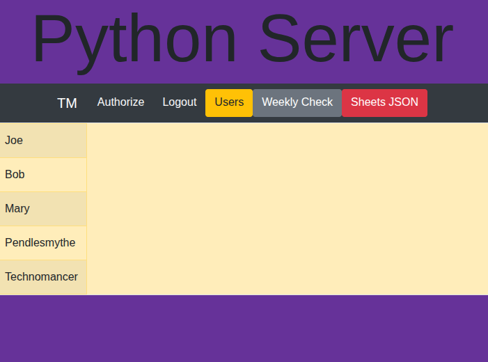

# Flask Server with User Database + Google Sheets Integration

This project is a **template web application** that sets up:  
✅ **A Python Flask server**  
✅ **Google Sheets API integration (with OAuth)**  
✅ **An SQLite3 user login + registration system**  

It’s designed as a fast-start boilerplate to connect a basic Python server with Google Workspace tools — letting you extend it into custom dashboards, automations, or data-driven apps.

---

## ✨ Features

- Secure Google OAuth flow for Sheets access  
- Reads and writes spreadsheet data in real time  
- Simple SQLite3-backed login and user management  
- Flask REST endpoints (separating backend and frontend)  
- Clear error flashing and feedback in the UI  
- Easily extendable (future: React frontend integration.)

---

## ⚙️ Tech Stack

- Python (Flask)  
- SQLite3
- Google Sheets API (with optional Google Drive API)  

---  

## 🚀 Setup & Usage

1️⃣ Clone the repo & install dependencies  

`git clone https://github.com/invisispider/python-google-sheets-server`  
`cd /path/to/project`  
`pip install pipenv`  
`pipenv install`  

2️⃣ Set up Google Cloud project

- Go to In the [Google Cloud Console](https://console.cloud.google.com/)  
- Create a **new project**  
- Enable the Google Sheets API (and optionally Google Drive API)  
- Configure OAuth consent + scopes  
- Download `client_secret.json` and place it in the local environment (for local development)  

3️⃣ Configure environment & database

- Set your .env variables (client IDs, secrets, etc.)  
- Initialize the SQLite3 database  

4️⃣ Run the Flask server

- `flask --app application run`  

5️⃣ Access the app

- Open `http://127.0.0.1:5000` in your browser  
- Use the provided buttons to test authorization, database, and Sheets interactions  

---

## 📸 Demo

---

## 🛠 Notes

- Current setup is configured for local development; production (using WSGI) is commented out and will need adjustments.  
- Only test users (added in Google Cloud) can bypass app verification for unverified scopes.  
- Example Flask routes include:
`/authorize`, `/login`, `/logout`, `/users`, `/weekly-check`, `/sheets-json`  

---

## 💼 Freelance Applications

I build or adapt **custom solutions like this** for small teams who:  
- Juggle data across Google Sheets, CRMs, or ERPs  
- Need **automated** dashboards or reports    
- Want a clean, intuitive web interface to monitor KPIs and insights  

If you’re wasting time on manual data work, I can help streamline and automate your process.
